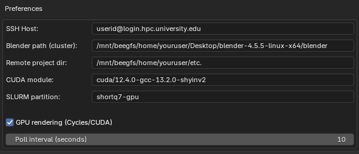
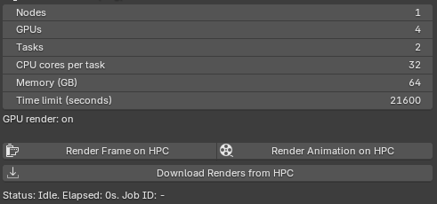

<!-- markdownlint-disable MD033 MD045 -->

# HPC Render

A Blender extension to render frames and animations on a high performance compute cluster using SLURM.

## Setup

    

- **SSH Host**: This is the thing you write when you SSH into your cluster.
- **Blender path (cluster)**: This is the absolute path to your Blender installation on the cluster.
- **Remote project dir**: This is where you want your Blender project (and render outputs) to go on the supercomputer when they're being rendered. It will copy the Blender file and render to `./renders` when it starts rendering.
- **CUDA module**: This is the CUDA module installation that you load. To find available installations on your cluster, SSH into your supercomputer cluster and run `module avail cuda`. Then, select one that looks reasonable from the list.
- **SLURM partition**: This is the partition of the node that will be called to run your project. You can find available partitions with `sinfo -s`, but verify that your selected partition has GPUs if needed.

## Usage

    

Note that you can't render a single frame across multiple nodes, since that would be very inefficient. Instead, the multi-node setup uses a queue system to render frames of an animation on the different nodes by opening a Blender instance to render a batch of frames from the queue.

- **Nodes**: The number of nodes you want to request. It's usually best to set this to 1, unless you are rendering a whole bunch of stuff. For each node you add, it *multiplies* the following parameters (e.g., 2 nodes with 4 GPUs would be 8 GPUs total).
- **Batch size**: When more than one node is requested, the batch size determines how many frames a given Blender instance will render from the animation frame queue. For optimal performance, the batch size should be the number of frames divided by the number of nodes.
- **GPUs**: The number of GPUs you want on a node.
- **Tasks**: The number of parallel threads you want on a node.
- **CPU cores per task**: The number of cores on a given thread of a given node.
- **Memory (GB)**: The ammount of memory (in gigabytes) allocated for a given node.
- **Time Limit**: The time limit you want to set on the render. You can find the maximum time limit for a given partition or configuration by running `sinfo -o "%P %l"`.

You can verify your configuration by consulting the available configurations on your cluster using `sinfo -N -l`. When rendering using many GPUs, it is ideal to reduce tile size to improve load balancing performance. This can be done in `Render Properties` > `Performance` > `Memory`.

## Benchmarks

Test Scene:

- 30 frames, 3 nodes, 4 GPUs per node: 55 seconds. GPU unknown (probably teslas or something)
- 30 frames, local: 1 hr 57 mins. Single RTX2060 Super

<!--
note to self: update new version with
git tag v1.0.X
git push origin v1.0.X
-->